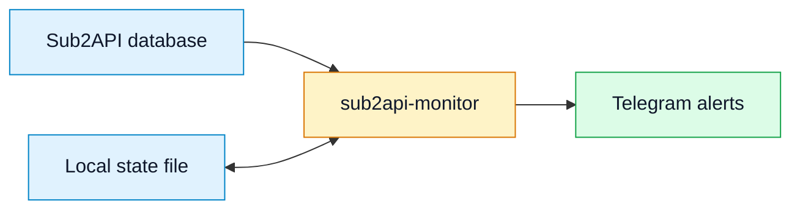

# sub2api-monitor

_A passive Sub2API monitoring daemon that sends privacy-aware Telegram alerts._

[](./LICENSE)
[](#requirements)
[](https://github.com/Wei-Shaw/sub2api)

`sub2api-monitor` watches an existing [Sub2API](https://github.com/Wei-Shaw/sub2api) PostgreSQL database and sends concise Telegram notifications. It is intentionally passive: it does not probe upstream providers, does not mutate Sub2API tables, and keeps operational secrets outside the Git repository.

## 🚀 Highlights

| Capability | What it does |
| --- | --- |
| Account alerts | Detects account additions, removals, group changes, and health changes such as error, rate limit, overload, temporary unschedulable, and expiry states |
| Settings-change alerts | Detects background admin/config changes across account, subscription/payment, user-management, and system-setting tables, with readable before/after diffs |
| Risk-control alerts | Detects new `content_moderation_logs` hits/blocks/errors from the Sub2API risk-control center and summarizes the affected user, key, group, model, action, score, and auto-ban status |
| Recharge/redeem alerts | Detects new used `redeem_codes`, subscription `payment_orders`, affiliate balance transfers, and falls back to `users.total_recharged` deltas on older schemas |
| Upstream error alerts | Reads `ops_error_logs` and reports actionable provider-side `400`, `429`, and `5xx` failures |
| Exit-network alerts | Separately reports proxy, DNS, timeout, TLS, and connection failures without exposing proxy credentials |
| Daily usage reports | Summarizes request count, token usage, cost, account-plan breakdowns, and top models |
| Telegram commands | Supports `/status`, `/accounts`, `/groups`, `/daily`, `/update`, `/ping`, and `/help` while the daemon is running |
| Interactive installer | Provides a menu-driven shell script for install, update, configuration, service management, and smoke tests |

## 🔒 Privacy and security

The project is designed for public GitHub hosting and privacy-aware operations.

| Area | Behavior |
| --- | --- |
| Secrets | Real Telegram tokens, chat IDs, database passwords, and Sub2API `.env` values stay outside the repository |
| User identifiers | Account and user names/emails are redacted by default with `REDACT_IDENTIFIERS=true` |
| Settings diffs | Sensitive fields such as tokens, passwords, API keys, payment configs, and encrypted secrets are compared by hash and shown only as “set/updated/cleared” |
| Risk-control logs | Telegram risk-control alerts omit request IDs and show only the redacted user/key context plus a short already-redacted prompt excerpt |
| Proxy data | Proxy alert cards show safe labels such as name, ID, protocol, and status, but not host, username, or password |
| Low-level IDs | Request IDs and raw ops-log IDs are omitted from default Telegram alert text |
| Database access | The monitor only reads Sub2API tables through `psql`; it does not write application data |
| Examples | README examples use placeholders or masked identifiers only |

Example recharge/redeem alert with redaction enabled:

```text
💰 Sub2API 用户充值/兑换
2026-06-01 13:45:20 CST
新增 2 条 / 余额合计 +50 / 权益 1 条

事件明细
• #42 us***@ex*** (user, active)
  余额充值/兑换：+50 · 余额：75 · 累计：150
  兑换记录#120 · 时间：06-01 13:45
• #42 us***@ex*** (user, active)
  订阅兑换/续期：Claude Max · 30 天
  兑换记录#121 · 时间：06-01 13:46
```

## 🧭 How it works



The daemon stores small local baselines in `STATE_FILE` so it can detect changes between polling intervals. Existing recharge/redeem records and recharge totals are baselined on first run, so enabling the feature does not replay historical events.

## ✅ Requirements

- Linux host running Sub2API with PostgreSQL
- Docker CLI access to the Sub2API PostgreSQL container
- Python 3.11 or newer
- `git` and `rsync` for self-update support
- Telegram bot token and destination chat/channel ID

Default paths are conventional and configurable:

| Setting | Default |
| --- | --- |
| Sub2API directory | `/opt/sub2api` |
| Monitor install directory | `/opt/sub2api-monitor` |
| Monitor config | `/etc/sub2api-monitor/config.env` |
| Monitor state | `/var/lib/sub2api-monitor/state.json` |
| PostgreSQL container | `sub2api-postgres` |

## ⚡ Quick start

Download the management script and start the interactive installer:

```bash
curl -fsSL https://raw.githubusercontent.com/jiwen77/sub2api-monitor/main/monitor.sh -o /tmp/sub2api-monitor.sh
sudo bash /tmp/sub2api-monitor.sh
```

Recommended first-run flow:

1. Choose `安装/更新程序（从 GitHub 拉取）`
2. Choose `配置 Telegram 通知`
3. Choose `测试 Telegram 通知`
4. Choose `查看账号状态（只显示，不发 TG）`
5. Choose `发送账号状态到 TG（立即发送）`
6. Choose `后台启动/重启监控（推荐）`

After installation, reopen the menu with:

```bash
sudo /opt/sub2api-monitor/monitor.sh
```

## 🛠️ Configuration

The runtime config lives outside Git:

```text
/etc/sub2api-monitor/config.env
```

Start from [`config.env.example`](./config.env.example), then fill in local values on the server.

```env
TELEGRAM_BOT_TOKEN=<telegram-bot-token>
TELEGRAM_CHAT_ID=<telegram-chat-or-channel-id>
REDACT_IDENTIFIERS=true
USER_RECHARGE_ALERTS_ENABLED=true
POLL_INTERVAL_SECONDS=60
```

Important options:

| Option | Default | Description |
| --- | --- | --- |
| `SUB2API_DIR` | `/opt/sub2api` | Sub2API deployment directory. The monitor reads this directory's `.env` for PostgreSQL credentials when present |
| `POSTGRES_CONTAINER` | `sub2api-postgres` | PostgreSQL container name |
| `TELEGRAM_BOT_TOKEN` | empty | Telegram bot token; never commit a real value |
| `TELEGRAM_CHAT_ID` | empty | Telegram chat, group, channel, or user ID; never commit a real value |
| `TELEGRAM_ALLOWED_CHAT_IDS` | empty | Optional comma-separated allowlist for bot commands; defaults to `TELEGRAM_CHAT_ID` |
| `POLL_INTERVAL_SECONDS` | `60` | Daemon polling interval. Recharges detected within one interval are grouped into one notification |
| `REDACT_IDENTIFIERS` | `true` | Redact account and user names/emails in Telegram messages |
| `DETAIL_LIMIT` | `12` | Maximum rows expanded in one Telegram card |
| `SETTINGS_CHANGE_ALERTS_ENABLED` | `true` | Send Telegram notifications when monitored admin/config tables change after the first baseline |
| `SETTINGS_CHANGE_TABLES` | empty | Optional comma-separated allowlist of tables to audit; empty uses built-in Sub2API admin/config tables and skips missing tables |
| `RISK_CONTROL_ALERTS_ENABLED` | `true` | Send Telegram notifications for new risk-control/content-moderation hits, blocks, hash/keyword blocks, auto-bans, and moderation errors after the first baseline |
| `RISK_CONTROL_ALERT_LIMIT_PER_POLL` | `500` | Maximum `content_moderation_logs` rows read per polling interval |
| `USER_RECHARGE_ALERTS_ENABLED` | `true` | Send Telegram notifications for new recharge/redeem events (`redeem_codes`, subscription `payment_orders`, affiliate transfers, with `users.total_recharged` fallback) |
| `ERROR_LOOKBACK_MINUTES` | `30` | Lookback window for new upstream errors |
| `ERROR_COOLDOWN_SECONDS` | `600` | Per-error-group cooldown to reduce repeated alerts |
| `UPSTREAM_ALLOWED_STATUS_CODES` | `400,429,500-599` | Provider/upstream HTTP statuses that should alert |
| `PROXY_ERROR_ALERTS_ENABLED` | `true` | Separately alert likely exit-proxy and network failures |
| `DAILY_REPORT_HOUR` | `0` | Local hour for daily report |
| `DAILY_REPORT_MINUTE` | `0` | Local minute for daily report |

Use menu option `13) 交互式修改配置项` for guided edits, or option `14) 手动编辑配置文件（nano）` for manual edits.

## 📣 Alerts and commands

### Alert categories

| Category | Source table | Trigger |
| --- | --- | --- |
| Account status | `accounts`, `account_groups`, `groups` | Account state or group-membership changes from the previous baseline |
| Settings/admin changes | `accounts`, `account_groups`, `groups`, `proxies`, `users`, `api_keys`, `user_allowed_groups`, `subscription_plans`, `user_subscriptions`, `payment_provider_instances`, `settings`, `announcements`, `channel_monitors`, and related admin/config tables | Any material row add/remove/update after the first baseline; runtime counters and high-churn usage windows are ignored to prevent noise |
| Risk-control trigger | `content_moderation_logs` | New flagged, blocked, keyword/hash-blocked, auto-banned, or moderation-error rows after the first baseline |
| User recharge/redeem | `redeem_codes`, `payment_orders`, `user_affiliate_ledger`, `users` | New used redeem records, completed subscription payment orders, affiliate balance transfers, or `total_recharged` fallback deltas after the first baseline |
| Upstream error | `ops_error_logs` | Provider-side actionable status codes, usually `400`, `429`, or `5xx` |
| Exit-network error | `ops_error_logs` | Proxy, DNS, timeout, TLS, connection reset/refused, or similar failures |
| Daily usage | `usage_logs` | Scheduled local-time daily summary |

### Telegram commands

Commands are accepted only from authorized chat IDs.

| Command | Description |
| --- | --- |
| `/status` | Send a health overview and current non-normal account details |
| `/accounts` | Send the full account list with group labels |
| `/groups` | Send a group-level health overview, then de-duplicated non-normal accounts |
| `/daily` | Send the previous-day/current-day usage report |
| `/update` | Check GitHub for a newer monitor version, show version + commit, and display a `🔄 立即更新` inline button when available |
| `/ping` | Check whether the daemon is receiving commands |
| `/help` | Show command help |

To authorize more than one chat, use placeholders like this:

```env
TELEGRAM_ALLOWED_CHAT_IDS=<chat-id-1>,<chat-id-2>
```

## 🧪 Manual commands

```bash
# Print the current account snapshot without sending Telegram.
python3 /opt/sub2api-monitor/sub2api_monitor.py --config /etc/sub2api-monitor/config.env account-summary

# Force-send the current account snapshot to Telegram.
python3 /opt/sub2api-monitor/sub2api_monitor.py --config /etc/sub2api-monitor/config.env account-summary --notify

# Run account, settings-change, risk-control, recharge, and upstream-error checks once.
python3 /opt/sub2api-monitor/sub2api_monitor.py --config /etc/sub2api-monitor/config.env run-once --notify

# Force-send the daily usage report.
python3 /opt/sub2api-monitor/sub2api_monitor.py --config /etc/sub2api-monitor/config.env daily --notify

# Register Telegram slash-command suggestions.
python3 /opt/sub2api-monitor/sub2api_monitor.py --config /etc/sub2api-monitor/config.env setup-telegram-commands

# Keep monitoring in the foreground.
python3 /opt/sub2api-monitor/sub2api_monitor.py --config /etc/sub2api-monitor/config.env daemon
```

## 🔁 Update and service management

Interactive update:

```bash
sudo /opt/sub2api-monitor/monitor.sh
# choose menu option 1
```

Non-interactive update:

```bash
sudo /opt/sub2api-monitor/monitor.sh --update
```

Systemd operations:

```bash
sudo systemctl enable --now sub2api-monitor.service
sudo systemctl status sub2api-monitor.service
sudo journalctl -u sub2api-monitor.service -f
```

For forks or pinned refs:

```bash
sudo UPDATE_REPO_URL=https://github.com/<owner>/<repo>.git \
  UPDATE_REF=main \
  /opt/sub2api-monitor/monitor.sh --update
```

## 🧑‍💻 Development

Run local checks before committing:

```bash
bash -n monitor.sh
python3 -m py_compile sub2api_monitor.py
PYTHONPATH=. python3 -m unittest discover -v -s tests
```

Recommended contribution checklist:

- Keep changes passive and read-only against Sub2API data
- Add or update tests for new alert logic
- Keep examples redacted and placeholder-based
- Do not commit runtime config, state files, logs, tokens, chat IDs, or database credentials

## 📄 License

MIT License. See [LICENSE](./LICENSE).
